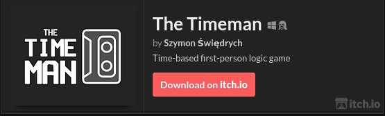
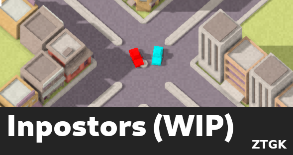

<h1 align="center"> Hello there! 👋 I'm Szymon Świędrych </h1>

---

I am a student of computer science at Łódź University of Technology, specializing
in video games. As a hobbyist, I create games in Unreal Engine and OpenGL.
Additionally, I have a strong interest in artificial intelligence and rendering.
My passion for gaming and technology motivates me to learn and explore new possibilities
in the field.

I :heart: Linux and FOSS!

---

### 🧰 Languages and Tools

 

---

## 🔭 I’m currently working on

---

## 🗺 Links

[Itch.io](https://erulathra.itch.io/)

[LinkedIn](https://www.linkedin.com/in/szymon-%C5%9Bwi%C4%99drych-01733a243/)

---

## 📊 Stats

---
